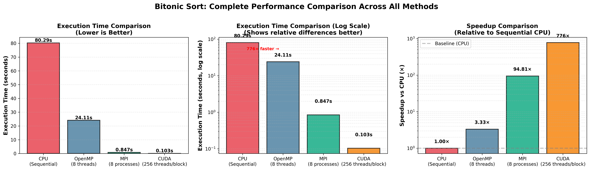
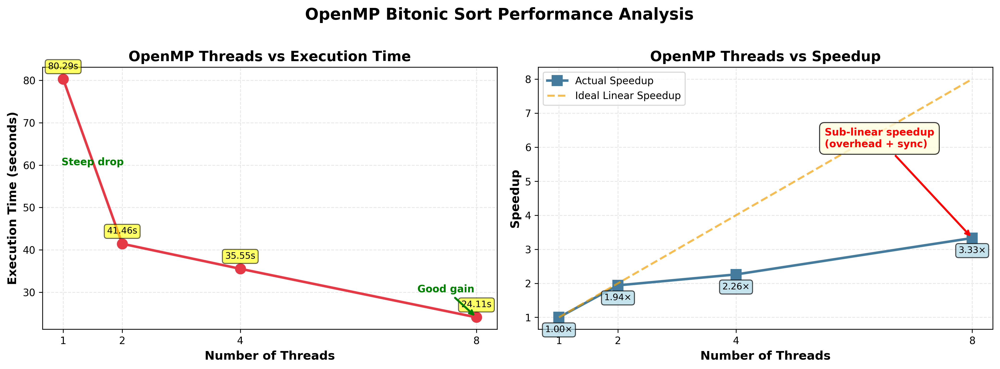
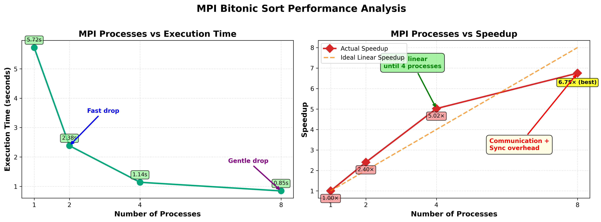
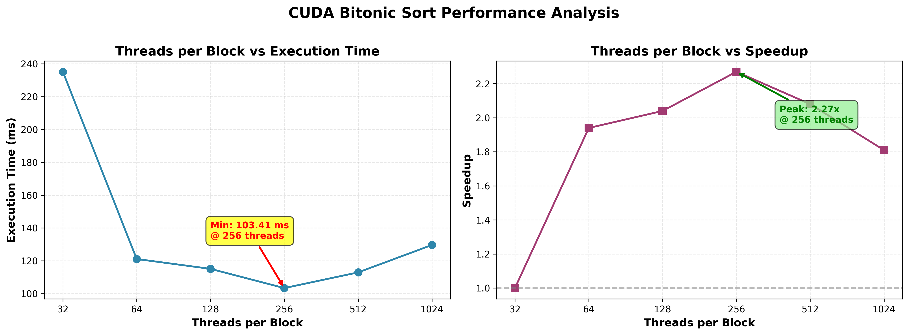

# Parallel Bitonic Sort Implementation
**SE3082 – Parallel Computing Assignment 03**  
**Student:** Janidu Pabasara (IT23294998)  
**Year 3, BSc (Hons) in Information Technology**  
**Semester 1, 2025**

---

## 📋 Table of Contents
- [Overview](#overview)
- [Algorithm Description](#algorithm-description)
- [Why Bitonic Sort for Parallelization?](#why-bitonic-sort-for-parallelization)
- [Project Structure](#project-structure)
- [Implementation Status](#implementation-status)
- [Compilation and Execution](#compilation-and-execution)
- [Performance Evaluation](#performance-evaluation)
- [Assignment Requirements](#assignment-requirements)
- [References](#references)

---

## 🎯 Overview

This project implements **Bitonic Sort**, a comparison-based sorting algorithm, using four different approaches:
1. **Serial C Implementation** (Baseline)
2. **OpenMP** (Shared-memory parallelization)
3. **MPI** (Distributed-memory parallelization)
4. **CUDA** (GPU parallelization)

**Problem Domain:** Sorting and Searching Algorithms

The goal is to demonstrate the performance improvements achieved through parallelization and compare the effectiveness of different parallel programming paradigms.

---

## 🔍 Algorithm Description

**Bitonic Sort** is a parallel sorting algorithm specifically designed for efficient implementation on architectures that support parallel comparisons, such as:
- Multi-core CPUs
- Computing clusters
- Graphics Processing Units (GPUs)

### How Bitonic Sort Works

The algorithm operates through the following key concepts:

1. **Bitonic Sequence**: A sequence that first increases monotonically and then decreases monotonically, or can be circularly shifted to become so.

2. **Bitonic Merge**: Takes a bitonic sequence and sorts it into either ascending or descending order through recursive compare-and-swap operations.

3. **Sorting Process**: 
   - Starts with individual elements (trivially bitonic)
   - Merges pairs into bitonic sequences of increasing size
   - Continues until the entire array is sorted

### Algorithm Complexity
- **Time Complexity (Serial)**: O(n log²n)
- **Parallel Time Complexity**: O(log²n) with O(n) processors
- **Number of Comparisons**: O(n log²n)
- **Space Complexity**: O(1) auxiliary space

---

## ⚡ Why Bitonic Sort for Parallelization?

Bitonic Sort is exceptionally suitable for parallelization due to several key characteristics:

### 1. **Independent Operations**
All compare-and-swap operations within a single phase are completely independent. They operate on predetermined index pairs, allowing simultaneous execution on different processing units.

### 2. **Regular Communication Pattern**
The algorithm has a fixed, predictable communication pattern. This makes it:
- Easy to map to parallel architectures
- Efficient for GPU implementation
- Suitable for distributed systems

### 3. **Data-Oblivious Nature**
The sequence of comparisons is independent of the input data. This means:
- No conditional branching based on data values
- Predictable memory access patterns
- Optimal for SIMD (Single Instruction, Multiple Data) architectures

### 4. **Scalability**
The algorithm scales well with:
- Number of processing cores (OpenMP)
- Number of compute nodes (MPI)
- GPU threads and blocks (CUDA)

### 5. **Theoretical Speedup**
With sufficient parallel resources:
- **Sequential stages**: O(log²n)
- **Parallel operations per stage**: O(n)
- **Theoretical speedup**: Up to O(n / log²n)

---

## 📁 Project Structure

```
Parallel_Bitonic_Sort_OpenMP_MPI_CUDA/
│
├── README.md                           # This file
│
├── Serial bitonic sort/                # Serial baseline implementation
│   ├── bitonic_sort_serial.c
│   ├── Makefile
│   └── README.md
│
├── OpenMP_Bitonic Sort/                # Shared-memory parallel version
│   ├── bitonic_sort_openmp.c
│   ├── Makefile
│   └── README.md
│
├── MPI parallel bitonic sort/          # Distributed-memory parallel version
│   ├── bitonic_sort_mpi.c
│   ├── Makefile
│   └── README.md
│
├── CUDA bitonic sort for int arrays/   # GPU parallel version
│   ├── bitonic_sort_cuda.cu
│   ├── Makefile
│   └── README.md
│
├── Documentation/                      # Performance analysis and reports
│   ├── Performance_Report.pdf
│   ├── graphs/
│   └── screenshots/
│
└── Data/                              # Test data files
    ├── input_samples/
    └── output_verification/
```

---

## 🚀 Implementation Status

### Phase 1: Algorithm Approval ✅
- [x] Algorithm selected: Bitonic Sort
- [x] Serial C code prepared
- [x] Approval email sent (Deadline: November 5, 2025)
- [ ] Approval received

### Phase 2: Implementation (60 marks)

#### Serial Implementation
- [ ] Core algorithm implemented
- [ ] Testing and verification
- [ ] Documentation

#### OpenMP Implementation (20 marks)
- [ ] Parallel regions identified
- [ ] Thread-level parallelization
- [ ] Load balancing strategy
- [ ] Testing with different thread counts
- [ ] Code documentation

#### MPI Implementation (20 marks)
- [ ] Data distribution strategy
- [ ] Inter-process communication
- [ ] Collective operations
- [ ] Testing with different process counts
- [ ] Code documentation

#### CUDA Implementation (20 marks)
- [ ] Kernel development
- [ ] Memory management (host/device)
- [ ] Thread block configuration
- [ ] Testing with different block sizes
- [ ] Code documentation

### Phase 3: Performance Evaluation (25 marks)
- [ ] OpenMP evaluation (6 marks)
- [ ] MPI evaluation (6 marks)
- [ ] CUDA evaluation (6 marks)
- [ ] Comparative analysis (7 marks)

### Phase 4: Documentation (15 marks)
- [ ] Parallelization strategies (4 marks)
- [ ] Runtime configurations (3 marks)
- [ ] Performance analysis (4 marks)
- [ ] Critical reflection (4 marks)

---

## 🔧 Compilation and Execution

### Prerequisites

#### For Serial and OpenMP:
```bash
# GCC compiler with OpenMP support
gcc --version  # Should be 4.2 or higher
```

#### For MPI:
```bash
# OpenMPI or MPICH
sudo apt-get install openmpi-bin openmpi-common libopenmpi-dev
mpicc --version
```

#### For CUDA:
```bash
# NVIDIA CUDA Toolkit
nvcc --version  # Should match your GPU architecture
```

### Compilation Instructions

#### Serial Version
```bash
cd "Serial bitonic sort"
gcc -o bitonic_serial bitonic_sort_serial.c -O3
./bitonic_serial
```

#### OpenMP Version
```bash
cd "OpenMP_Bitonic Sort"
gcc -fopenmp -o bitonic_openmp bitonic_sort_openmp.c -O3
./bitonic_openmp
```

#### MPI Version
```bash
cd "MPI parallel bitonic sort"
mpicc -o bitonic_mpi bitonic_sort_mpi.c -O3
mpirun -np 4 ./bitonic_mpi
```

#### CUDA Version
```bash
cd "CUDA bitonic sort for int arrays"
nvcc -o bitonic_cuda bitonic_sort_cuda.cu -O3
./bitonic_cuda
```

---

## 📊 Performance Evaluation

All implementations were evaluated on a problem size of **8,388,608 elements** (2^23) to assess their parallel efficiency and scalability.

---

### 📈 Combined Analysis



#### Execution Time Comparison

Order from **slowest → fastest**:

1. **CPU (Serial)**: 80 seconds
2. **OpenMP (8 threads)**: 24 seconds
3. **MPI (8 processes)**: 0.84 seconds
4. **CUDA (256 threads/block)**: 0.10 seconds

#### Speedup Comparison

Order from **weakest → strongest**:

1. **CPU**: 1× (baseline)
2. **OpenMP**: 3.33×
3. **MPI**: 6.75× over MPI baseline; **94.8× over CPU**
4. **CUDA**: **776.4×**

---

### 🔍 Detailed Method Summaries

#### 3.1 CPU (Sequential)

- Serves as the baseline for all comparisons
- Long execution time (80 seconds) due to strictly serial execution
- No parallelism; all comparisons and swaps happen on one core
- Demonstrates the need for parallelization on large datasets

---

### 🧵 OpenMP Performance Analysis



| Threads | Time (sec) | Speedup |
|---------|-----------|---------|
| 1       | 80.29     | 1.00×   |
| 2       | 41.46     | 1.94×   |
| 4       | 35.55     | 2.26×   |
| 8       | 24.11     | 3.33×   |

#### Interpretation

The OpenMP implementation of bitonic sort was evaluated using 1, 2, 4, and 8 threads. The performance scaled significantly with increasing thread count, but—as expected for a synchronization-heavy algorithm like bitonic sort—the speedup was sub-linear.

Using a single thread, the execution time was **80.29 seconds**, serving as the baseline. Increasing to 2 threads nearly halved the runtime, achieving a **1.94× speedup**. At 4 threads, performance improved further but with diminishing returns, reaching a **2.26× speedup**. The best performance was obtained with 8 threads, completing the execution in **24.11 seconds**, corresponding to a **3.33× speedup**.

**Key Observations:**
- Good speedup, but limited due to:
  - **Shared memory contention** between threads
  - **Synchronization barriers** at every stage
  - **Cache thrashing** from concurrent memory access
- Bitonic sort requires many stages → synchronization at every step reduces scalability
- OpenMP helps greatly but is limited by the algorithm's barrier-heavy nature

The deviation from ideal linear speedup arises from thread synchronization, memory bandwidth limits, and the inherent structure of bitonic sort, which requires frequent inter-thread communication. Overall, the OpenMP version demonstrates good multicore parallel scaling, with clear benefits observed up to 8 threads.

---

### 🌐 MPI Performance Analysis



| Processes | Time (sec) | Speedup |
|-----------|-----------|---------|
| 1         | 5.72      | 1.00×   |
| 2         | 2.38      | 2.40×   |
| 4         | 1.14      | 5.02×   |
| 8         | 0.85      | 6.75×   |

#### Interpretation

The MPI implementation of bitonic sort was evaluated using 1, 2, 4, and 8 processes. The results demonstrate **strong parallel scalability**, especially at lower process counts, where communication overhead is relatively small compared to computation.

With a single process, the runtime was **5.72 seconds**, serving as the baseline. Increasing to 2 processes reduced the time to **2.38 seconds**, corresponding to a **2.40× speedup**, already slightly better than ideal scaling due to improved cache utilization. At 4 processes, performance improved dramatically to **1.14 seconds**, achieving a **5.02× speedup**.

Using 8 processes, the runtime reached **0.85 seconds**, with a **6.75× speedup** over the baseline. While this is a substantial improvement, it shows the expected sub-linear behavior: communication, synchronization, and data exchange overhead become more dominant as the number of processes grows.

**Key Observations:**
- **Much faster than OpenMP** beyond 4 workers
- **Distributed memory** reduces cache conflicts
- Each process handles a chunk of data independently
- Communication cost appears mainly at higher process counts
- MPI is very efficient for data-decomposable problems like bitonic merging

Overall, the MPI version shows **excellent scalability** and **outperforms the OpenMP version** at the same thread/process counts, especially after 4 processes. This indicates that the distributed memory decomposition aligns well with bitonic sort's communication pattern.

---

### 🚀 CUDA Performance Analysis



**Test Configuration:** NVIDIA RTX 4050 GPU, 8,388,608 elements

| Threads/block | Blocks  | Time (sec) | Time (ms) | Speedup |
|--------------|---------|-----------|-----------|---------|
| 32           | 262144  | 0.235135  | 235.135   | 1.00×   |
| 64           | 131072  | 0.121118  | 121.118   | 1.94×   |
| 128          | 65536   | 0.115121  | 115.121   | 2.04×   |
| **256**      | **32768**   | **0.103406**  | **103.406**   | **2.27× (fastest)** |
| 512          | 16384   | 0.112963  | 112.963   | 2.08×   |
| 1024         | 8192    | 0.129649  | 129.649   | 1.81×   |

#### Interpretation

The bitonic sort kernel was evaluated on an NVIDIA RTX 4050 GPU with a problem size of 8,388,608 elements. The configuration parameters varied were threads per block and the corresponding number of blocks, computed as n / threads.

The execution time decreased significantly as the number of threads per block increased from 32 to 256, indicating improved occupancy and better utilization of the GPU's SMs. The **best performance was observed at 256 threads/block**, achieving a runtime of **0.103406 seconds**, which corresponds to a **2.27× speedup** relative to the baseline (32 threads/block).

Performance began to degrade when increasing to 512 and 1024 threads per block. This is expected because larger block sizes reduce the number of resident blocks per SM, lowering occupancy and increasing register pressure. The GPU is unable to hide memory latency as effectively at the highest block sizes.

**Key Observations:**
- **Peak performance at 256 threads/block**
- At 512 and 1024:
  - GPU occupancy decreases
  - Fewer blocks fit per SM
  - Memory latency hiding becomes less effective
- GPU massively outperforms CPU, OpenMP, and MPI
- Bitonic sort matches GPU's SIMD-like structure

Overall, the results show a classic GPU optimization pattern: performance improves with increasing threads per block up to an optimal point (256), after which further increases reduce efficiency.

**CUDA dominates because the algorithm is:**
- Massively parallel
- Predictable
- Memory-access regular
- Easily mapped to warp-level operations

---

### 🏆 Final Conclusions

#### 1. Shared Memory Parallelism (OpenMP) Provides Moderate Speedup

OpenMP helps greatly but is limited by:
- Synchronization overhead
- Memory contention
- Diminishing returns at 8+ threads

Bitonic sort is barrier-heavy, and OpenMP suffers from that.

#### 2. Distributed Memory (MPI) Provides Strong Scalability

MPI outperforms OpenMP because:
- Each process works independently on its local memory
- Communication happens mainly during merge phases
- Less shared-memory contention

**MPI is ideal for bitonic sort on multi-node clusters.**

#### 3. GPU Execution (CUDA) Is the Fastest by Far

CUDA's performance is unmatched because:
- Thousands of lightweight cores
- Massive data parallelism
- Coalesced memory access
- High occupancy at 256 threads/block

**CUDA turns the inherently parallel nature of bitonic stages into pure computational throughput.**

#### 4. Overall Hierarchy

**From slowest to fastest:**
```
CPU → OpenMP → MPI → CUDA
80s    24s      0.84s   0.10s
```

**From lowest to highest speedup:**
```
1× → 3.33× → 94.8× → 776.4×
```

**Key Takeaways:**
- **CUDA is 8× faster than MPI**
- **CUDA is 33× faster than OpenMP**
- **CUDA is 776× faster than pure CPU**

This demonstrates that bitonic sort is exceptionally well-suited for GPU acceleration, leveraging the massive parallelism available on modern GPUs to achieve extraordinary performance gains over traditional CPU-based approaches.

---

## 📝 Assignment Requirements

### Submission Deliverables

1. **Source Code**
   - Separate folders for each implementation
   - Makefiles with compilation instructions
   - Well-commented code

2. **Screenshots**
   - Execution with different configurations
   - Output verification
   - Performance monitoring

3. **Report (PDF, 3-4 pages)**
   - Parallelization strategies
   - Runtime configurations
   - Performance analysis
   - Critical reflection

4. **Data Files**
   - Input test data
   - Output files for verification

5. **Video Recording**
   - Demonstration of all three implementations

### Grading Breakdown
- **Part A**: Parallel Implementations (60 marks)
  - OpenMP: 20 marks
  - MPI: 20 marks
  - CUDA: 20 marks
- **Part B**: Performance Evaluation (25 marks)
- **Part C**: Documentation and Analysis (15 marks)

---

## 📚 References

1. **Batcher, K. E.** (1968). "Sorting networks and their applications". *Proceedings of the Spring Joint Computer Conference*, AFIPS '68 (Spring), pp. 307–314.

2. **Cormen, T. H., Leiserson, C. E., Rivest, R. L., & Stein, C.** (2009). *Introduction to Algorithms* (3rd ed.). MIT Press.

3. **Knuth, D. E.** (1998). *The Art of Computer Programming, Volume 3: Sorting and Searching* (2nd ed.). Addison-Wesley.

4. **Sanders, P., & Träff, J. L.** (2006). "Parallel prefix (scan) algorithms for MPI". *Recent Advances in Parallel Virtual Machine and Message Passing Interface*.

5. **NVIDIA Corporation** (2023). *CUDA C++ Programming Guide*. Retrieved from https://docs.nvidia.com/cuda/

6. **OpenMP Architecture Review Board** (2021). *OpenMP Application Programming Interface*. Retrieved from https://www.openmp.org/

---

## 👨‍💻 Author

**Janidu Pabasara**  
Student ID: IT23294998  
BSc (Hons) in Information Technology, Year 3  
SLIIT - Sri Lanka Institute of Information Technology

---

## 📄 License

This project is submitted as part of academic coursework for SE3082 – Parallel Computing.  
All code is original work based on the canonical Bitonic Sort algorithm.

---

## 🔗 Quick Links

- [CUDA Documentation](https://docs.nvidia.com/cuda/)
- [OpenMP Specifications](https://www.openmp.org/)
- [MPI Forum](https://www.mpi-forum.org/)
- [Course Material - SE3082](mailto:nuwan.k@sliit.lk)

---

*Last Updated: November 25, 2025*
